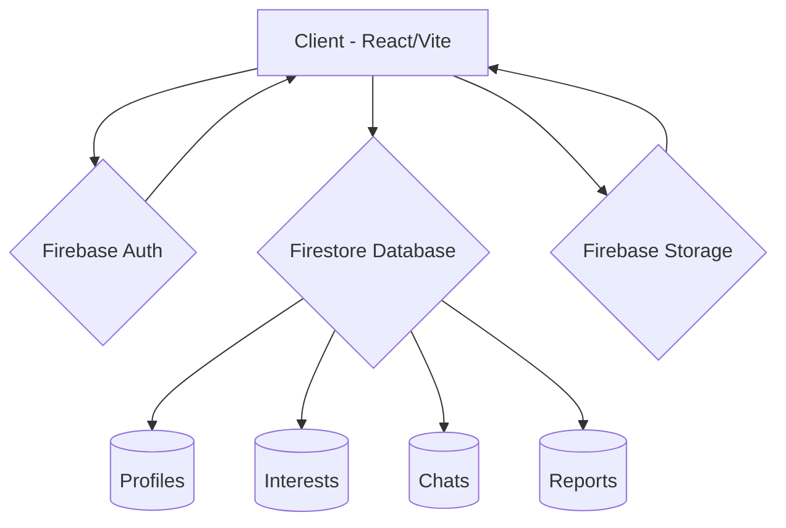

# 💍 MatchMitra — Because Every Match Matters

<div align="center">
  
  <h3>A Premium Matrimonial Matchmaking Platform</h3>
  <p><b>Built by Team Dreamers</b></p>
</div>

---

## 🌟 Overview

**MatchMitra** is a modern, secure, and feature-rich matrimonial platform designed to help individuals find their perfect life partners. Built with a focus on trust, safety, and real-time interaction, MatchMitra streamlines the journey from discovery to conversation.

## ✨ Key Features

- 🔐 **Secure Authentication**: Multi-method login via Email/Password and Google OAuth.
- 👤 **Smart Profiles**: Comprehensive profile creation with real-time completion tracking and automated trust scoring.
- 🔍 **Advanced Discovery**: Intelligent filtering by age, location, profession, religion, and more.
- 💌 **Interest Workflow**: A seamless "Send → Review → Accept/Reject" interest system that ensures privacy.
- 💬 **Real-time Communication**: Instant messaging with support for text, images, and voice notes—unlocked only upon mutual interest acceptance.
- 🛡️ **Trust & Safety**: Built-in reporting system, automated trust scores, and admin-verified badges to ensure a safe community.
- 📊 **User Dashboard**: A personalized hub to track profile views, interests, matches, and message activity.
- 🤖 **Helpful AI**: Integrated rule-based chatbot to assist users with common queries and platform navigation.

## 🛠️ Tech Stack

### Frontend
- **React 19**: Modern UI library for a responsive and high-performance experience.
- **Vite**: Ultra-fast build tool and development server.
- **Tailwind CSS**: Utility-first CSS framework for premium, responsive designs.
- **Framer Motion**: Smooth animations and transitions.
- **Lucide React**: Clean and consistent iconography.

### Backend & Infrastructure
- **Firebase**:
  - **Firestore**: Real-time NoSQL database for profiles, interests, and chats.
  - **Authentication**: Secure user management and OAuth.
  - **Storage**: Scalable media storage for profile photos and chat attachments.
  - **Security Rules**: Robust server-side validation and authorization.
- **Node.js & Express**: (Optional/Admin) Backend services for extended logic.

## 🏗️ Architecture



## 🚀 Getting Started

### Prerequisites
- Node.js (v18+)
- npm or yarn

### Installation

1. **Clone the repository:**
   ```bash
   git clone https://github.com/Shivani-mali/MatchMitra.git
   cd MatchMitra
   ```

2. **Install dependencies:**
   ```bash
   npm install
   ```

3. **Environment Setup:**
   Create a `.env` file in the root directory and add your Firebase credentials:
   ```env
   VITE_FIREBASE_API_KEY=your_api_key
   VITE_FIREBASE_AUTH_DOMAIN=your_auth_domain
   VITE_FIREBASE_PROJECT_ID=your_project_id
   VITE_FIREBASE_STORAGE_BUCKET=your_storage_bucket
   VITE_FIREBASE_MESSAGING_SENDER_ID=your_sender_id
   VITE_FIREBASE_APP_ID=your_app_id
   ```

4. **Run development server:**
   ```bash
   npm run dev
   ```

## 🛡️ Security & Privacy

MatchMitra prioritizes user privacy through:
- **Strict Firestore Rules**: Only participants can access their private chats and interest data.
- **Encrypted Media**: All images and voice notes are stored securely in Firebase Storage.
- **Reporting System**: Quick-action reporting to keep the platform free from inappropriate behavior.

---

<div align="center">
  <p>Made with ❤️ by <b>Team Dreamers</b></p>
</div>
